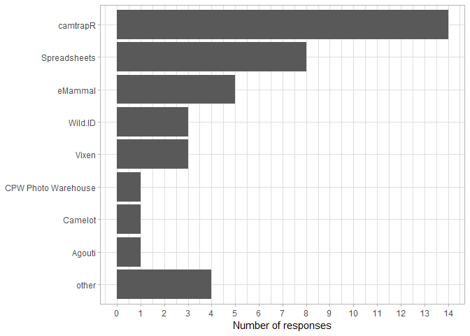

Software to manage Camera Trapping Images
================

Here are the Results from [the
survey](https://forms.gle/uafXkWzh8FinCsv86) *Software to manage Camera
Trapping Images* posted on
[wildlabs.net](https://www.wildlabs.net/community/thread/688) on
21.03.2019 and shared via
[Twitter](https://twitter.com/WILDLABSNET/status/1108676937868812288?s=20)
subsequently. We received 27 to date (2019-03-27). The survey consisted
of four questions:

1.  What software do you use to mange your camera trapping images?
2.  If you use other software, please comment
3.  What environment do you work in?
4.  If you work in a different environment, please specify

## Question No 1

> What software do you use to mange your camera trapping images?

(multiple answers possible)

<!-- -->

## Question No 2

> If you use other software, please comment:

  - Digikam for image tagging
  - Trapper (open source, published and developed by Jakub Bubnicki)
  - Timelapse
  - Timelapse
  - Home made database KORAPhoto

<!-- end of list -->

(the above is a list of all non-empty responses)

## Question No 3

> What environment do you work in?

<!-- -->

## Question No 4

> If you work in a different environment, please specify:

(No responses)
