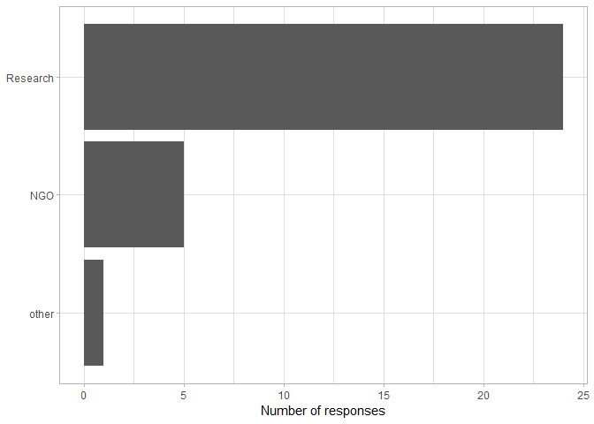

Software to manage Camera Trapping Images
================

Here are the results from [the
survey](https://forms.gle/uafXkWzh8FinCsv86) *Software to manage Camera
Trapping Images* posted on
[wildlabs.net](https://www.wildlabs.net/community/thread/688) on
2019-03-21 and shared via
[Twitter](https://twitter.com/WILDLABSNET/status/1108676937868812288?s=20)
subsequently. We received 31 responses to date (2019-04-26). Feel free
to download/pull this repo to redo the analysis with the newest
responses (the RMarkdown File `Readme.Rmd` pulls the data directly from
the googledoc).

The survey consisted of four questions:

1.  What software do you use to mange your camera trapping images?
2.  If you use other software, please comment
3.  What environment do you work in?
4.  If you work in a different environment, please specify

## Question No 1

> What software do you use to mange your camera trapping images?

(multiple answers possible)

<!-- -->

## Question No 2

> If you use other software, please comment:

(below is a list of all non-empty responses)

  - Digikam for image tagging
  - Trapper (open source, published and developed by Jakub Bubnicki)
  - Timelapse
  - Timelapse
  - Home made database KORAPhoto
  - Custom ‘software’, which is a host of R scripts which work on the
    image metadata

<!-- end of list -->

## Question No 3

> What environment do you work in?

<!-- -->

## Question No 4

> If you work in a different environment, please specify:

(below is a list of all non-empty responses)

  - There are other software packages not on this list (e.g. Timelapse2
    and the ZSL CTAT tool) which I know people use. There are some you
    could add to your list here:
    <https://www.researchgate.net/publication/320402776_Camera-trapping_for_conservation_a_guide_to_best-practices>

<!-- end of list -->
